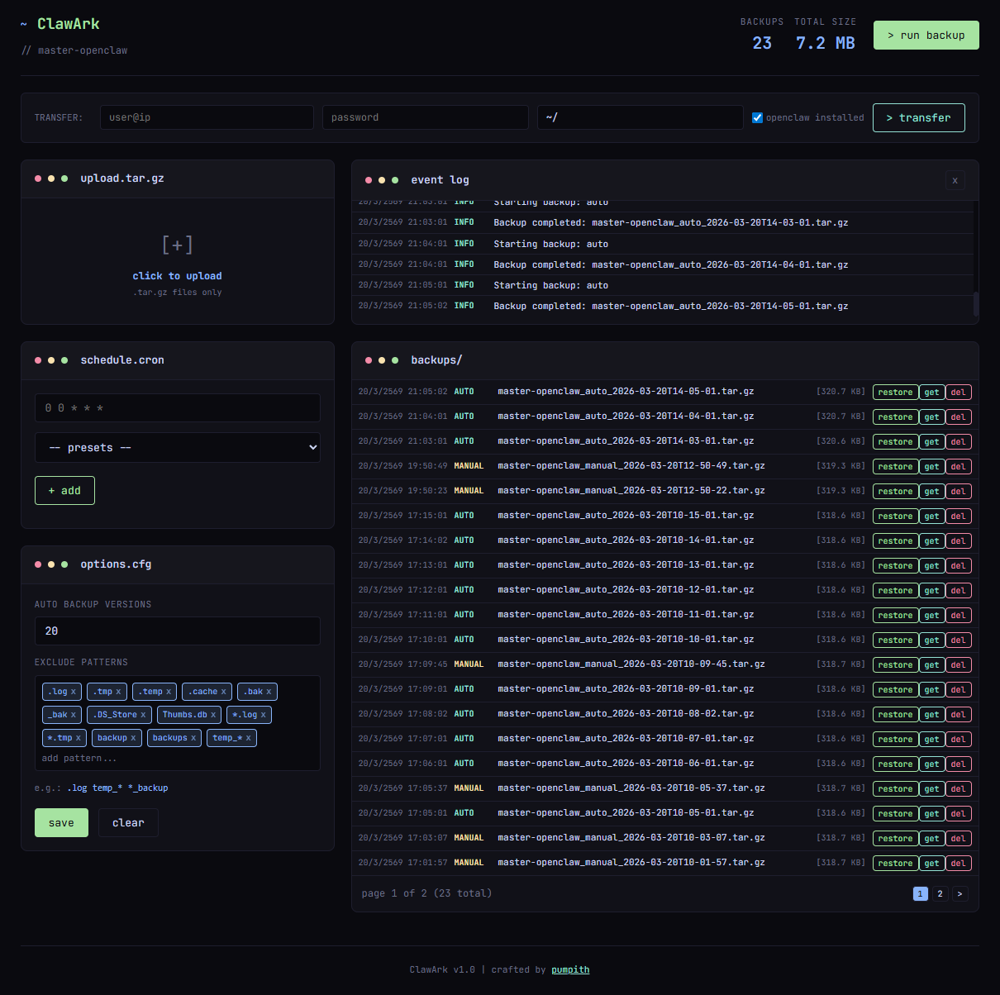

# OpenClaw Backup

Web UI และ CLI สำหรับ backup, restore และ transfer OpenClaw data



## Features

- 📦 **Create/Restore backups** - สร้างและกู้คืน backup ผ่าน Web UI
- ⬆️ **Upload/Download** - อัพโหลดและดาวน์โหลดไฟล์ backup
- 🔄 **Transfer** - ถ่ายโอนข้อมูลไปยัง remote server พร้อมตั้งค่า OpenClaw อัตโนมัติ
- ⏰ **Schedule backups** - ตั้งเวลา backup อัตโนมัติด้วย cron
- 🎛️ **Exclude patterns** - กำหนด patterns สำหรับ exclude ไฟล์/โฟลเดอร์
- 📱 **Modern dark theme UI** - หน้าตาสวยงาม
- 📋 **Event log** - ดู log การทำงานแบบ real-time

## Installation

```bash
# Clone to ~/.openclaw/
cd ~/.openclaw
git clone https://github.com/pumpithai/openclaw-backup.git
cd openclaw-backup

# Run installer
chmod +x install.sh
./install.sh
```

## Usage

### Web UI

```bash
# Start server
./start.sh

# Or with custom port
PORT=4000 node backup-server.js
```

เปิด browser: `http://localhost:4000`

### Transfer to Remote Server

1. กรอก `user@ip` - เช่น `cloudm9n@192.168.10.151`
2. กรอก `destination path` - เช่น `~/`
3. กรอก `password`
4. ✅ ถ้า remote มี OpenClaw ติดตั้งแล้ว - ติ๊ก "openclaw installed"
5. ❌ ถ้า remote ยังไม่มี OpenClaw - ไม่ติ๊ก (ระบบจะติดตั้งให้อัตโนมัติ)
6. กด `> transfer`

**ขั้นตอนที่ Transfer ทำ:**
1. ติดตั้ง OpenClaw (ถ้ายังไม่มี)
2. rsync ไฟล์ไปยัง remote
3. อัพเดต config paths
4. เปลี่ยน ownership
5. รัน `openclaw doctor --fix`
6. Restart gateway

### CLI

```bash
# Create backup
./openclaw-backup.sh

# Exclude patterns
./openclaw-backup.sh --exclude=workspace
./openclaw-backup.sh --exclude=media --exclude=cache

# Include only
./openclaw-backup.sh --include-only=skills

# List backups
./openclaw-backup.sh --list

# Restore
./openclaw-backup.sh --restore /path/to/backup.tar.gz
```

## Backup Contents

Backups ทั้ง `.openclaw` directory:

| Folder | Description |
|--------|-------------|
| `openclaw.json` | Main config |
| `credentials/` | API keys & tokens |
| `agents/` | Agent configs |
| `workspace*/*` | Workspace files |
| `telegram/` | Telegram session |
| `cron/` | Scheduled tasks |
| `devices/` | Device configs |
| `identity/` | Identity data |
| `memory/` | Memory data |
| `skills/` | Custom skills |

## Configuration

### Environment Variables

```bash
OPENCLAW_DIR=~/.openclaw     # OpenClaw directory
BACKUP_DIR=~/.openclaw/backups  # Backup location
PORT=4000                   # Web UI port
```

### Exclude Patterns

กำหนดได้ในหน้า Web UI (options.cfg):

```
.log, .tmp, .cache, *.bak, temp_*, backup, backups
```

### Cron Schedule

```bash
# Examples
0 * * * *      # ทุกชั่วโมง
0 0 * * *      # ทุกวัน
0 0 * * 0      # ทุกสัปดาห์
0 0 1 * *      # ทุกเดือน
```

## Systemd Service

```bash
# Create service
mkdir -p ~/.config/systemd/user
cat > ~/.config/systemd/user/openclaw-backup.service << EOF
[Unit]
Description=OpenClaw Backup Server

[Service]
Type=simple
WorkingDirectory=%h/.openclaw/openclaw-backup
ExecStart=/usr/bin/node %h/.openclaw/openclaw-backup/backup-server.js
Restart=on-failure

[Install]
WantedBy=default.target
EOF

# Enable
systemctl --user enable --now openclaw-backup
```

## Commands

```bash
# Start server
./start.sh

# Stop server
pkill -f 'node backup-server.js'

# View logs
tail -f logs/app.log
```

## Dependencies

- Node.js (v14+)
- rsync
- sshpass (สำหรับ transfer)
- tar
- cron

## Install sshpass

```bash
# Ubuntu/Debian
sudo apt install sshpass

# macOS
brew install sshpass
```

## License

MIT

## Author

[pumpith](https://www.facebook.com/pumpith)
